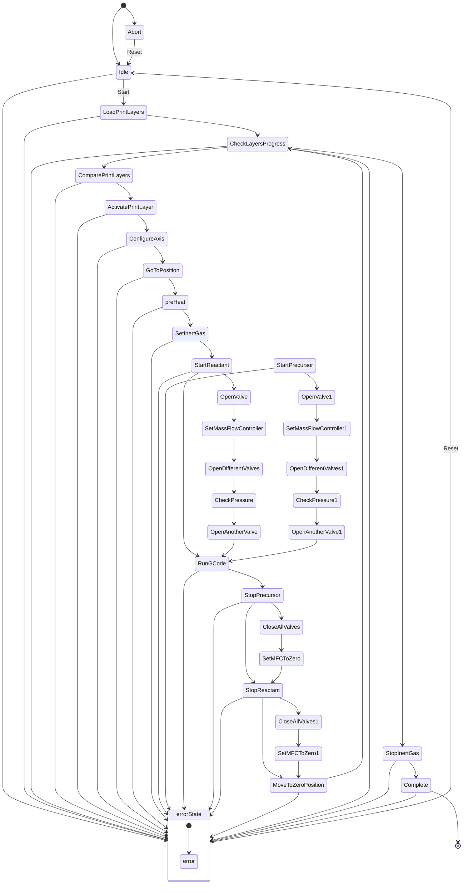

```mermaid
stateDiagram
    [*] --> Idle
    Idle --> LoadPrintLayers : Start
    LoadPrintLayers --> CheckLayersProgress
    CheckLayersProgress --> ComparePrintLayers
    ComparePrintLayers --> ActivatePrintLayer
    ActivatePrintLayer --> ConfigureAxis
    ConfigureAxis --> GoToPosition
    GoToPosition --> preHeat
    preHeat --> SetInertGas
    SetInertGas --> StartReactant
    StartReactant --> RunGCode
    RunGCode --> StopPrecursor
    StopPrecursor --> StopReactant
    StopReactant --> MoveToZeroPosition
    MoveToZeroPosition --> CheckLayersProgress
    CheckLayersProgress --> StopInertGas
    StopInertGas --> Complete
    Complete --> [*]

    StartReactant --> OpenValve
    OpenValve --> SetMassFlowController
    SetMassFlowController --> OpenDifferentValves
    OpenDifferentValves --> CheckPressure
    CheckPressure --> OpenAnotherValve
    OpenAnotherValve --> RunGCode

    StartPrecursor --> OpenValve1
    OpenValve1 --> SetMassFlowController1
    SetMassFlowController1 --> OpenDifferentValves1
    OpenDifferentValves1 --> CheckPressure1
    CheckPressure1 --> OpenAnotherValve1
    OpenAnotherValve1 --> RunGCode

    StopPrecursor --> CloseAllValves
    CloseAllValves --> SetMFCToZero
    SetMFCToZero --> StopReactant

    StopReactant --> CloseAllValves1
    CloseAllValves1 --> SetMFCToZero1
    SetMFCToZero1 --> MoveToZeroPosition

    state errorState {
        [*] --> error
    }

    Idle --> errorState
    LoadPrintLayers --> errorState
    CheckLayersProgress --> errorState
    ComparePrintLayers --> errorState
    ActivatePrintLayer --> errorState
    ConfigureAxis --> errorState
    GoToPosition --> errorState
    preHeat --> errorState
    SetInertGas --> errorState
    StartReactant --> errorState
    StartPrecursor --> errorState
    RunGCode --> errorState
    StopPrecursor --> errorState
    StopReactant --> errorState
    MoveToZeroPosition --> errorState
    CheckLayersProgress --> errorState
    StopInertGas --> errorState
    Complete --> errorState

    [*] --> Abort
    Abort --> Idle : Reset
    errorState --> Idle : Reset
```