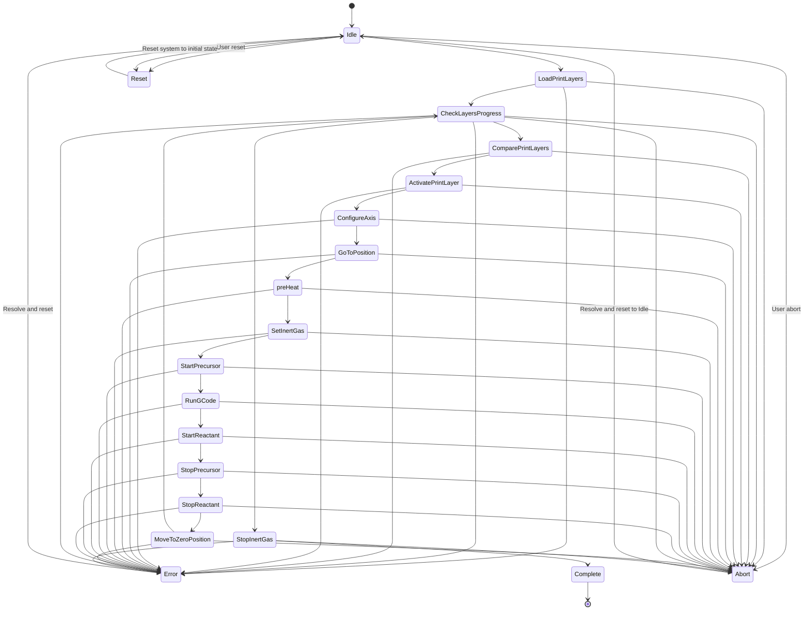

```mermaid
stateDiagram
    [*] --> Idle
    Idle --> LoadPrintLayers
    Idle --> Reset

    LoadPrintLayers --> CheckLayersProgress
    LoadPrintLayers --> Error

    CheckLayersProgress --> ComparePrintLayers
    CheckLayersProgress --> Error

    ComparePrintLayers --> ActivatePrintLayer
    ComparePrintLayers --> Error

    ActivatePrintLayer --> ConfigureAxis
    ActivatePrintLayer --> Error

    ConfigureAxis --> GoToPosition
    ConfigureAxis --> Error

    GoToPosition --> preHeat
    GoToPosition --> Error

    preHeat --> SetInertGas
    preHeat --> Error

    SetInertGas --> StartPrecursor
    SetInertGas --> Error

    StartPrecursor --> RunGCode
    StartPrecursor --> Error

    RunGCode --> StartReactant
    RunGCode --> Error

    StartReactant --> StopPrecursor
    StartReactant --> Error

    StopPrecursor --> StopReactant
    StopPrecursor --> Error

    StopReactant --> MoveToZeroPosition
    StopReactant --> Error

    MoveToZeroPosition --> CheckLayersProgress
    MoveToZeroPosition --> Error

    CheckLayersProgress --> StopInertGas
    CheckLayersProgress --> Error

    StopInertGas --> Complete
    StopInertGas --> Error

    Complete --> [*]

    Error --> Idle : Resolve and reset

    Idle --> Abort : User abort
    LoadPrintLayers --> Abort
    CheckLayersProgress --> Abort
    ComparePrintLayers --> Abort
    ActivatePrintLayer --> Abort
    ConfigureAxis --> Abort
    GoToPosition --> Abort
    preHeat --> Abort
    SetInertGas --> Abort
    StartPrecursor --> Abort
    RunGCode --> Abort
    StartReactant --> Abort
    StopPrecursor --> Abort
    StopReactant --> Abort
    MoveToZeroPosition --> Abort
    CheckLayersProgress --> Abort
    StopInertGas --> Abort
    Abort --> Idle : Resolve and reset to Idle

    Idle --> Reset : User reset
    Reset --> Idle : Reset system to initial state

```