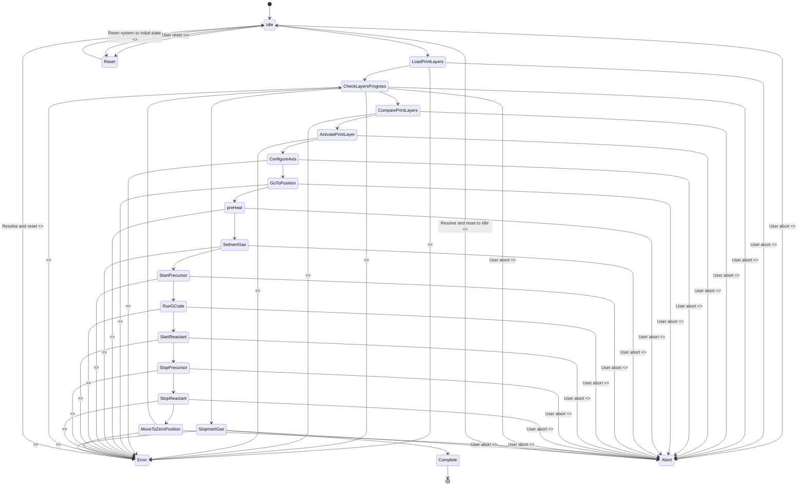

```mermaid
stateDiagram-v2
    [*] --> Idle
    Idle --> LoadPrintLayers
    Idle --> Reset : <<resetColor>>
    
    LoadPrintLayers --> CheckLayersProgress
    LoadPrintLayers --> Error : <<errorColor>>

    CheckLayersProgress --> ComparePrintLayers
    CheckLayersProgress --> Error : <<errorColor>>

    ComparePrintLayers --> ActivatePrintLayer
    ComparePrintLayers --> Error : <<errorColor>>

    ActivatePrintLayer --> ConfigureAxis
    ActivatePrintLayer --> Error : <<errorColor>>

    ConfigureAxis --> GoToPosition
    ConfigureAxis --> Error : <<errorColor>>

    GoToPosition --> preHeat
    GoToPosition --> Error : <<errorColor>>

    preHeat --> SetInertGas
    preHeat --> Error : <<errorColor>>

    SetInertGas --> StartPrecursor
    SetInertGas --> Error : <<errorColor>>

    StartPrecursor --> RunGCode
    StartPrecursor --> Error : <<errorColor>>

    RunGCode --> StartReactant
    RunGCode --> Error : <<errorColor>>

    StartReactant --> StopPrecursor
    StartReactant --> Error : <<errorColor>>

    StopPrecursor --> StopReactant
    StopPrecursor --> Error : <<errorColor>>

    StopReactant --> MoveToZeroPosition
    StopReactant --> Error : <<errorColor>>

    MoveToZeroPosition --> CheckLayersProgress
    MoveToZeroPosition --> Error : <<errorColor>>

    CheckLayersProgress --> StopInertGas
    CheckLayersProgress --> Error : <<errorColor>>

    StopInertGas --> Complete
    StopInertGas --> Error : <<errorColor>>

    Complete --> [*]
    
    Error --> Idle : Resolve and reset <<errorColor>>
    Abort --> Idle : Resolve and reset to Idle <<abortColor>>
    
    Idle --> Abort : User abort <<abortColor>>
    LoadPrintLayers --> Abort : User abort <<abortColor>>
    CheckLayersProgress --> Abort : User abort <<abortColor>>
    ComparePrintLayers --> Abort : User abort <<abortColor>>
    ActivatePrintLayer --> Abort : User abort <<abortColor>>
    ConfigureAxis --> Abort : User abort <<abortColor>>
    GoToPosition --> Abort : User abort <<abortColor>>
    preHeat --> Abort : User abort <<abortColor>>
    SetInertGas --> Abort : User abort <<abortColor>>
    StartPrecursor --> Abort : User abort <<abortColor>>
    RunGCode --> Abort : User abort <<abortColor>>
    StartReactant --> Abort : User abort <<abortColor>>
    StopPrecursor --> Abort : User abort <<abortColor>>
    StopReactant --> Abort : User abort <<abortColor>>
    MoveToZeroPosition --> Abort : User abort <<abortColor>>
    CheckLayersProgress --> Abort : User abort <<abortColor>>
    StopInertGas --> Abort : User abort <<abortColor>>

    Idle --> Reset : User reset <<resetColor>>
    Reset --> Idle : Reset system to initial state <<resetColor>>

    %% Define the colors
    classDef defaultColor stroke:#333, stroke-width:2px;
    classDef errorColor stroke:#FF6347, stroke-width:3px, stroke-dasharray: 5,5;
    classDef abortColor stroke:#6A5ACD, stroke-width:3px;
    classDef resetColor stroke:#2E8B57,

```