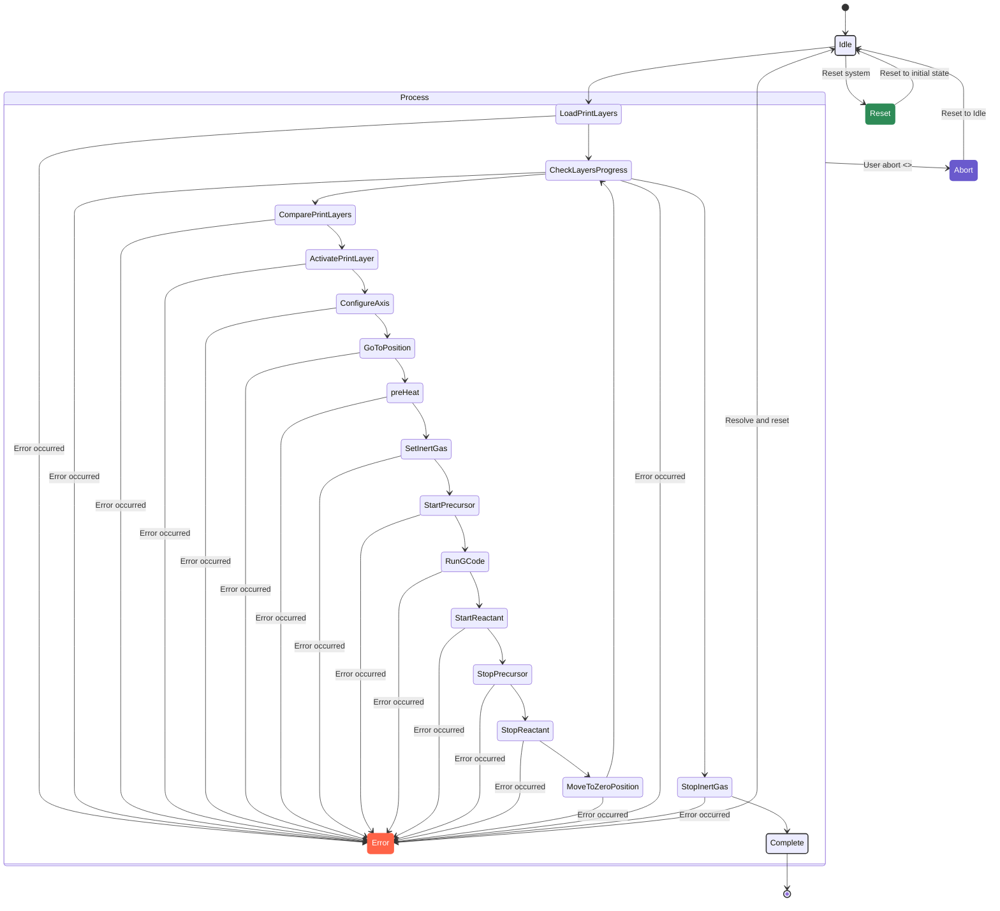

```mermaid
stateDiagram-v2
    [*] --> Idle

    Idle --> LoadPrintLayers
    Idle --> Reset : Reset system
    class Idle, Reset defaultColor

    state Process {
        direction TB
        LoadPrintLayers --> CheckLayersProgress
        LoadPrintLayers --> Error : Error occurred
        class LoadPrintLayers defaultColor

        CheckLayersProgress --> ComparePrintLayers
        CheckLayersProgress --> Error : Error occurred
        class CheckLayersProgress defaultColor

        ComparePrintLayers --> ActivatePrintLayer
        ComparePrintLayers --> Error : Error occurred
        class ComparePrintLayers defaultColor

        ActivatePrintLayer --> ConfigureAxis
        ActivatePrintLayer --> Error : Error occurred
        class ActivatePrintLayer defaultColor

        ConfigureAxis --> GoToPosition
        ConfigureAxis --> Error : Error occurred
        class ConfigureAxis defaultColor

        GoToPosition --> preHeat
        GoToPosition --> Error : Error occurred
        class GoToPosition defaultColor

        preHeat --> SetInertGas
        preHeat --> Error : Error occurred
        class preHeat defaultColor

        SetInertGas --> StartPrecursor
        SetInertGas --> Error : Error occurred
        class SetInertGas defaultColor

        StartPrecursor --> RunGCode
        StartPrecursor --> Error : Error occurred
        class StartPrecursor defaultColor

        RunGCode --> StartReactant
        RunGCode --> Error : Error occurred
        class RunGCode defaultColor

        StartReactant --> StopPrecursor
        StartReactant --> Error : Error occurred
        class StartReactant defaultColor

        StopPrecursor --> StopReactant
        StopPrecursor --> Error : Error occurred
        class StopPrecursor defaultColor

        StopReactant --> MoveToZeroPosition
        StopReactant --> Error : Error occurred
        class StopReactant defaultColor

        MoveToZeroPosition --> CheckLayersProgress
        MoveToZeroPosition --> Error : Error occurred
        class MoveToZeroPosition defaultColor

        CheckLayersProgress --> StopInertGas
        CheckLayersProgress --> Error : Error occurred
        class CheckLayersProgress defaultColor

        StopInertGas --> Complete
        StopInertGas --> Error : Error occurred
        class StopInertGas defaultColor
    }

    Complete --> [*]
    class Complete defaultColor

    Error --> Idle : Resolve and reset
    class Error errorColor

    Process --> Abort : User abort <<abortColor>>
    class Abort abortColor

    Abort --> Idle : Reset to Idle
    Reset --> Idle : Reset to initial state
    class Reset resetColor

    %% Define the colors
    classDef defaultColor stroke:#333, stroke-width:2px;
    classDef errorColor stroke:#FF6347, stroke-width:3px, fill:#FF6347, color:#FFF;
    classDef abortColor stroke:#6A5ACD, stroke-width:3px, fill:#6A5ACD, color:#FFF;
    classDef resetColor stroke:#2E8B57, stroke-width:3px, fill:#2E8B57, color:#FFF;
```