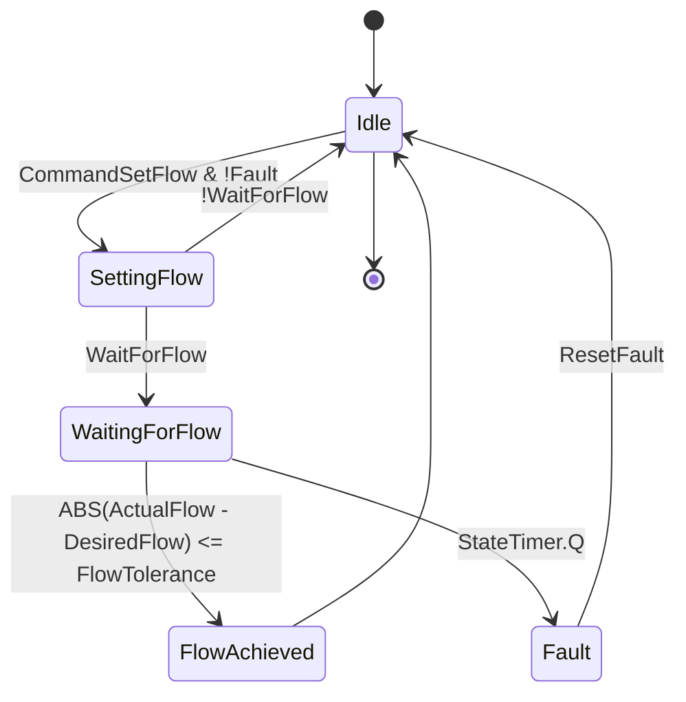

## State Diagram


## Function block
``` bash

TYPE MFCState :
(
    Idle,           // Controller is idle, waiting for commands
    SettingFlow,    // Controller is in the process of setting the flow rate
    WaitingForFlow, // Controller is waiting for the flow rate to stabilize within the tolerance
    FlowAchieved,   // Desired flow rate has been achieved and stabilized
    Fault           // An error or fault condition has been detected
);
END_TYPE

-----------------------------------------------------------------------------------------------------------
FUNCTION_BLOCK FB_MFCControl

VAR_INPUT
    DesiredFlow : REAL;               // Desired flow value to set
    ActualFlow : REAL;                // Actual flow value from the sensor
    FlowTolerance : REAL;             // Tolerance for flow value
    MaxTime : TIME := T#10S;          // Maximum allowed time to reach the desired flow, default 10 seconds
    ResetFault : BOOL := FALSE;       // Command to reset fault condition
    CommandSetFlow : BOOL := FALSE;   // Command to set a new flow rate
    WaitForFlow : BOOL := TRUE;       // Command to wait for the flow to reach the desired value
END_VAR

VAR_OUTPUT
    IsFlowAchieved : BOOL;            // Indicates if the desired flow has been achieved and stabilized
    MFCControlState : MFCState;       // Current state of the MFC control
    Fault : BOOL;                     // Fault status
END_VAR

VAR
    StateTimer : TON;                 // TON timer for operation time monitoring
END_VAR

// State Machine
CASE MFCControlState OF
    MFCState.Idle:
        IF ResetFault THEN
            Fault := FALSE;
        END_IF
        IsFlowAchieved := FALSE; // Reset IsFlowAchieved when setting flow
        IF NOT Fault AND CommandSetFlow THEN
            MFCControlState := MFCState.SettingFlow;
            StateTimer(IN := TRUE, PT := MaxTime);
        END_IF

    MFCState.SettingFlow:
        IF WaitForFlow THEN
            MFCControlState := MFCState.WaitingForFlow;
        ELSE
            IsFlowAchieved := TRUE;
            MFCControlState := MFCState.Idle;
        END_IF

    MFCState.WaitingForFlow:
        IF ABS(ActualFlow - DesiredFlow) <= FlowTolerance THEN
            IsFlowAchieved := TRUE;
            MFCControlState := MFCState.FlowAchieved;
        ELSIF StateTimer.Q THEN
            StateTimer(IN := FALSE);
            Fault := TRUE;
            MFCControlState := MFCState.Fault;
        END_IF

    MFCState.FlowAchieved:
        StateTimer(IN := FALSE); // Stop the timer when flow is achieved
        MFCControlState := MFCState.Idle;

    MFCState.Fault:
        Fault := TRUE;
        IsFlowAchieved := FALSE;
        IF ResetFault THEN
            MFCControlState := MFCState.Idle;
            Fault := FALSE;
        END_IF
END_CASE
```

## Main program
```bash
PROGRAM Main
VAR
    MFCControl : FB_MFCControl; // Create an instance of the function block
    CheckFlow : BOOL := FALSE;  // Variable to check if the flow rate has been achieved
END_VAR

// Set the initial parameters
MFCControl.DesiredFlow := 10.0; // Set the desired flow to 10 sccm
MFCControl.MaxTime := T#2M; // Set the maximum time to wait for the flow to stabilize to 2 minutes
MFCControl.CommandSetFlow := TRUE; // Start the flow setting process

// Main control loop
WHILE TRUE DO
    MFCControl(); // Call the function block to update its state

    // Check if the flow has been achieved
    IF MFCControl.IsFlowAchieved THEN
        // Flow has been achieved, set the next desired flow
        MFCControl.DesiredFlow := 20.0; // Set the desired flow to 20 sccm
        MFCControl.CommandSetFlow := TRUE; // Start the flow setting process
    END_IF

    // Check for faults
    IF MFCControl.Fault THEN
        // Handle the fault condition here
        // For example, you could stop the process, alert the user, etc.
        // Once the fault has been handled, you can reset the fault condition
        MFCControl.ResetFault := TRUE;
    END_IF

    // Check if the user wants to set the flow to 30 sccm
    IF MFCControl.IsFlowAchieved AND MFCControl.DesiredFlow = 20.0 THEN
        MFCControl.DesiredFlow := 30.0; // Set the desired flow to 30 sccm
        MFCControl.WaitForFlow := FALSE; // Do not wait for the flow to stabilize
        MFCControl.CommandSetFlow := TRUE; // Start the flow setting process
    END_IF

    // Check if the user wants to check if the flow rate has been achieved
    IF CheckFlow THEN
        IF MFCControl.IsFlowAchieved THEN
            // The flow rate has been achieved, you can notify the user here
        ELSE
            // The flow rate has not been achieved yet, you can notify the user here
        END_IF
        CheckFlow := FALSE; // Reset the CheckFlow variable
    END_IF
END_WHILE
END_PROGRAM
```
