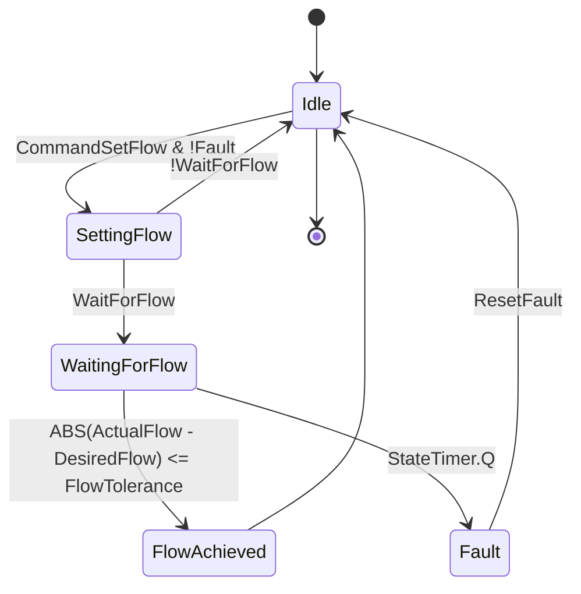

```mermaid
stateDiagram-v2
    [*] --> Idle
    Idle --> SettingFlow : CommandSetFlow & !Fault
    SettingFlow --> WaitingForFlow : WaitForFlow
    SettingFlow --> Idle : !WaitForFlow
    WaitingForFlow --> FlowAchieved : ABS(ActualFlow - DesiredFlow) <= FlowTolerance
    WaitingForFlow --> Fault : StateTimer.Q
    FlowAchieved --> Idle
    Fault --> Idle : ResetFault
    Idle --> [*]
```
