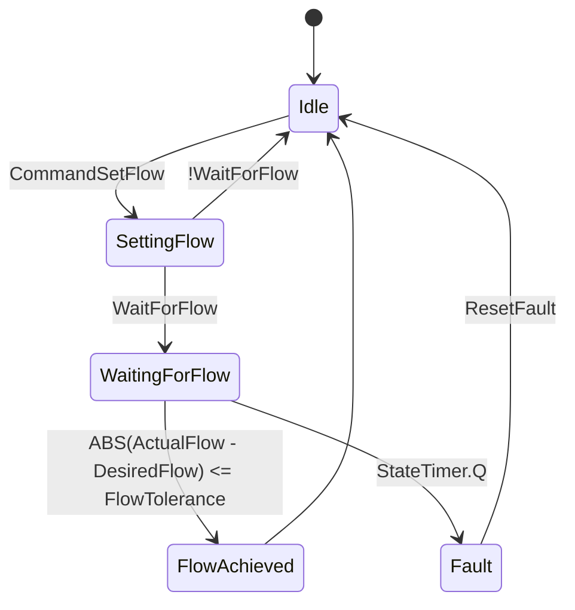

## State Diagram


## Function block
``` bash
TYPE MFCState :
(
    Idle,           // Controller is idle, waiting for commands
    SettingFlow,    // Controller is in the process of setting the flow rate
    WaitingForFlow, // Controller is waiting for the flow rate to stabilize within the tolerance
    FlowAchieved,   // Desired flow rate has been achieved and stabilized
    Fault           // An error or fault condition has been detected
);
END_TYPE
-----------------------------------------------------------------------------------------------------------
FUNCTION_BLOCK FB_MFCControl

VAR_INPUT
    DesiredFlow : REAL;               // Desired flow value to set
    ActualFlow : REAL;                // Actual flow value from the sensor
    FlowTolerance : REAL;             // Tolerance for flow value
    MaxTime : TIME := T#10S;          // Maximum allowed time to reach the desired flow, default 10 seconds
    ResetFault : BOOL := FALSE;       // Command to reset fault condition
    CommandSetFlow : BOOL := FALSE;   // Command to set a new flow rate
    WaitForFlow : BOOL := TRUE;       // Command to wait for the flow to reach the desired value
END_VAR

VAR_OUTPUT
    MFCControlState : MFCState;       // Current state of the MFC control
    Fault : BOOL;                     // Fault status
END_VAR

VAR
    StateTimer : TON;                 // TON timer for operation time monitoring
END_VAR


// State Machine
CASE MFCControlState OF
    MFCState.Idle:
        IF CommandSetFlow THEN
            MFCControlState := MFCState.SettingFlow;
            StateTimer(IN := TRUE, PT := MaxTime);
            CommandSetFlow := FALSE; // Reset CommandSetFlow after transitioning to SettingFlow state
        END_IF

    MFCState.SettingFlow:
        IF WaitForFlow THEN
            MFCControlState := MFCState.WaitingForFlow;
        ELSE
            MFCControlState := MFCState.Idle;
            StateTimer(IN := FALSE); // Stop the timer if not waiting for flow
        END_IF

    MFCState.WaitingForFlow:
        IF ABS(ActualFlow - DesiredFlow) <= FlowTolerance THEN
            MFCControlState := MFCState.FlowAchieved;
            StateTimer(IN := FALSE); // Stop the timer when flow is achieved
        ELSIF StateTimer.Q THEN
            StateTimer(IN := FALSE);
            Fault := TRUE;
            MFCControlState := MFCState.Fault;
        END_IF

    MFCState.FlowAchieved:
        StateTimer(IN := FALSE); // Stop the timer when flow is achieved
        MFCControlState := MFCState.Idle;

    MFCState.Fault:
        Fault := TRUE;
        // Reset Fault and State if ResetFault is TRUE
        IF ResetFault THEN
            Fault := FALSE;
            MFCControlState := MFCState.Idle;
            StateTimer(IN := FALSE); // Stop the timer when fault is reset
        END_IF
END_CASE
```

## Main program
```bash
PROGRAM Main
VAR
    MFCControl : FB_MFCControl; // Instance of the MFCControl function block
    OperationSuccessful : BOOL; // Flag to check if the first operation was successful
END_VAR

// Set the desired flow rate to 10 sccm
MFCControl.DesiredFlow := 10.0;
MFCControl.MaxTime := T#5M; // Set the maximum allowed time to 5 minutes
MFCControl.CommandSetFlow := TRUE; // Command to set a new flow rate

// Wait for the flow to reach the desired value
WHILE MFCControl.MFCControlState <> MFCState.FlowAchieved AND MFCControl.MFCControlState <> MFCState.Fault DO
    // Continue the program execution
    MFCControl();
END_WHILE

// Check if the first operation was successful
IF MFCControl.MFCControlState = MFCState.FlowAchieved THEN
    OperationSuccessful := TRUE;
ELSE
    OperationSuccessful := FALSE;
END_IF

// If the first operation was successful, set the desired flow rate to 20 sccm
IF OperationSuccessful THEN
    MFCControl.DesiredFlow := 20.0;
    MFCControl.CommandSetFlow := TRUE; // Command to set a new flow rate

    // Wait for the flow to reach the desired value
    WHILE MFCControl.MFCControlState <> MFCState.FlowAchieved AND MFCControl.MFCControlState <> MFCState.Fault DO
        // Continue the program execution
        MFCControl();
    END_WHILE
END_IF
END_PROGRAM
```
