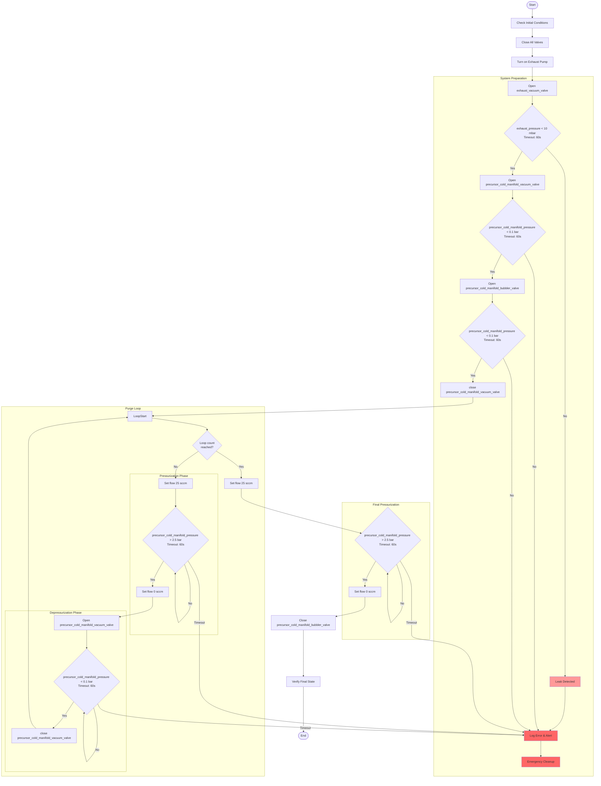

```mermaid
flowchart TB
    Start([Start]) --> InitialCheck[Check Initial Conditions]
    InitialCheck --> Step0[Close All Valves]
    Step0 --> Step1[Turn on Exhaust Pump]
    Step1 --> Step2[Open exhaust_vacuum_valve]
    
    subgraph System Preparation
        Step2 --> Step3{"exhaust_pressure < 10 mbar<br>Timeout: 60s"}
        Step3 -->|No| Leak[Leak Detected]
        Leak --> ErrorHandler[Log Error & Alert]
        ErrorHandler --> CleanupAndEnd[Emergency Cleanup]
        Step3 -->|Yes| Step4[Open precursor_cold_manifold_vacuum_valve]
        Step4 --> InitialEvacuation{"precursor_cold_manifold_pressure < 0.1 bar<br>Timeout: 60s"}
        InitialEvacuation -->|No| ErrorHandler
        InitialEvacuation -->|Yes| OpenBubbler[Open precursor_cold_manifold_bubbler_valve]
        OpenBubbler --> ConfirmEvacuation{"precursor_cold_manifold_pressure < 0.1 bar<br>Timeout: 60s"}
        ConfirmEvacuation -->|No| ErrorHandler
        ConfirmEvacuation -->|Yes| PrepComplete[close precursor_cold_manifold_vacuum_valve]
    end

    PrepComplete --> LoopStart

    subgraph Purge Loop
        direction TB
        LoopStart --> LoopCounter{"Loop count<br>reached?"}
        
        subgraph Pressurization Phase
            SetFlow[Set flow 25 sccm] --> MonitorPressure1
            MonitorPressure1{"precursor_cold_manifold_pressure > 2.5 bar<br>Timeout: 60s"} -->|No| MonitorPressure1
            MonitorPressure1 -->|Yes| StopFlow[Set flow 0 sccm]
        end
        
        subgraph Depressurization Phase
            OpenVacuum[Open precursor_cold_manifold_vacuum_valve] --> MonitorPressure2
            MonitorPressure2{"precursor_cold_manifold_pressure < 0.1 bar<br>Timeout: 60s"} -->|No| MonitorPressure2
            MonitorPressure2 -->|Yes| CloseVacuum[close precursor_cold_manifold_vacuum_valve]
        end
        
        LoopCounter -->|No| SetFlow
        StopFlow --> OpenVacuum
        CloseVacuum --> LoopStart
        LoopCounter -->|Yes| FinalPhase
    end

    subgraph Final Pressurization
        FinalPhase[Set flow 25 sccm] --> FinalPressure{"precursor_cold_manifold_pressure > 2.5 bar<br>Timeout: 60s"}
        FinalPressure -->|No| FinalPressure
        FinalPressure -->|Yes| FinalFlow[Set flow 0 sccm]
    end

    FinalFlow --> CloseBubbler[Close precursor_cold_manifold_bubbler_valve]
    CloseBubbler --> Cleanup[Verify Final State]
    Cleanup --> End([End])

    %% Error Handling Paths
    MonitorPressure1 --> |Timeout| ErrorHandler
    MonitorPressure2 --> |Timeout| ErrorHandler
    FinalPressure --> |Timeout| ErrorHandler

    style ErrorHandler fill:#ff6666
    style CleanupAndEnd fill:#ff6666
    style Leak fill:#ff9999
```
