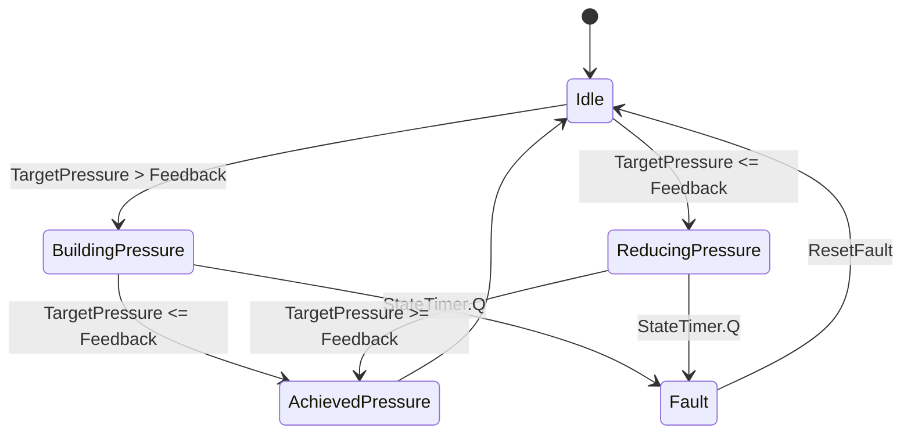

## State diagram


## Code
```bash
(* Enum for Pressure Control States *)
TYPE PressureState :
(
    Idle,
    BuildingPressure,
    ReducingPressure,
    AchievedPressure,
    Fault
);
END_TYPE
---------------------------------------------------------------------------------------------------------
FUNCTION_BLOCK FB_PressureControl
VAR_INPUT
    Feedback : REAL;         // Feedback indicating the actual pressure value
    TargetPressure : REAL;   // Target pressure value to achieve
    MaxTime : TIME := T#5S;  // Maximum allowed operation time (default 5 seconds)
    ResetFault : BOOL := FALSE; // Command to reset fault condition
END_VAR

VAR_OUTPUT
    State : PressureState;   // Current state of the pressure control
    Fault : BOOL;            // Fault status
END_VAR

VAR
    StateTimer : TON;        // TON timer for operation time monitoring
END_VAR


// State Machine
CASE State OF
    PressureState.Idle:
        IF TargetPressure > Feedback THEN
            State := PressureState.BuildingPressure;
        ELSE
            State := PressureState.ReducingPressure;
        END_IF
        StateTimer(IN := TRUE, PT := MaxTime);

    PressureState.BuildingPressure:
        IF TargetPressure <= Feedback THEN
            State := PressureState.AchievedPressure;
            StateTimer(IN := FALSE);
        ELSIF StateTimer.Q THEN
            State := PressureState.Fault;
            StateTimer(IN := FALSE);
        END_IF

    PressureState.ReducingPressure:
        IF TargetPressure >= Feedback THEN
            State := PressureState.AchievedPressure;
            StateTimer(IN := FALSE);
        ELSIF StateTimer.Q THEN
            State := PressureState.Fault;
            StateTimer(IN := FALSE);
        END_IF

    PressureState.AchievedPressure:
        State := PressureState.Idle;

    PressureState.Fault:
        Fault := TRUE;
        // Reset Fault and State if ResetFault is TRUE
        IF ResetFault THEN
            Fault := FALSE;
            State := PressureState.Idle;
        END_IF
END_CASE
```

## Usuage
```bash
```
