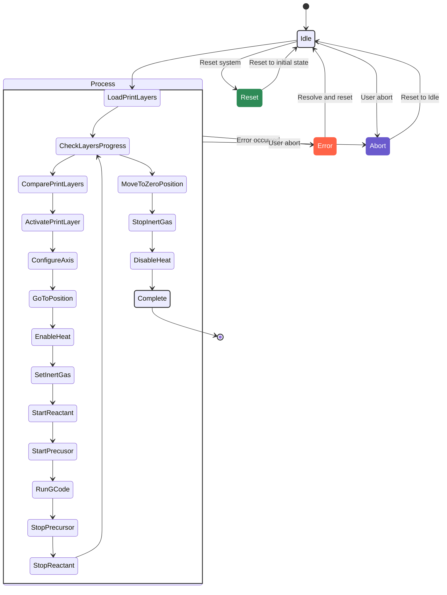

```mermaid
stateDiagram-v2
    [*] --> Idle

    Idle --> LoadPrintLayers
    Idle --> Reset : Reset system
    class Idle, Reset defaultColor

    state Process {
        direction TB
        LoadPrintLayers --> CheckLayersProgress
        CheckLayersProgress --> ComparePrintLayers
        ComparePrintLayers --> ActivatePrintLayer
        ActivatePrintLayer --> ConfigureAxis
        ConfigureAxis --> GoToPosition
        GoToPosition --> EnableHeat
        EnableHeat --> SetInertGas
        SetInertGas --> StartReactant
        StartReactant --> StartPrecusor
        StartPrecusor --> RunGCode
        RunGCode --> StopPrecursor
        StopPrecursor --> StopReactant
        StopReactant --> CheckLayersProgress 
        CheckLayersProgress --> MoveToZeroPosition
        MoveToZeroPosition --> StopInertGas
        StopInertGas --> DisableHeat
        DisableHeat --> Complete
    }

    Complete --> [*]
    class Complete defaultColor

    %% Error and Abort are external states
    Process --> Error : Error occurred
    class Process defaultColor

    Error --> Idle : Resolve and reset
    class Error errorColor

    %% Abort transition from an abstract point representing all states
    Idle --> Abort : User abort
    Process --> Abort : User abort
    class Abort abortColor

    Abort --> Idle : Reset to Idle
    Reset --> Idle : Reset to initial state
    class Reset resetColor

    %% Define the colors
    classDef defaultColor stroke:#333, stroke-width:2px;
    classDef errorColor stroke:#FF6347, stroke-width:3px, fill:#FF6347, color:#FFF;
    classDef abortColor stroke:#6A5ACD, stroke-width:3px, fill:#6A5ACD, color:#FFF;
    classDef resetColor stroke:#2E8B57, stroke-width:3px, fill:#2E8B57, color:#FFF;

```
