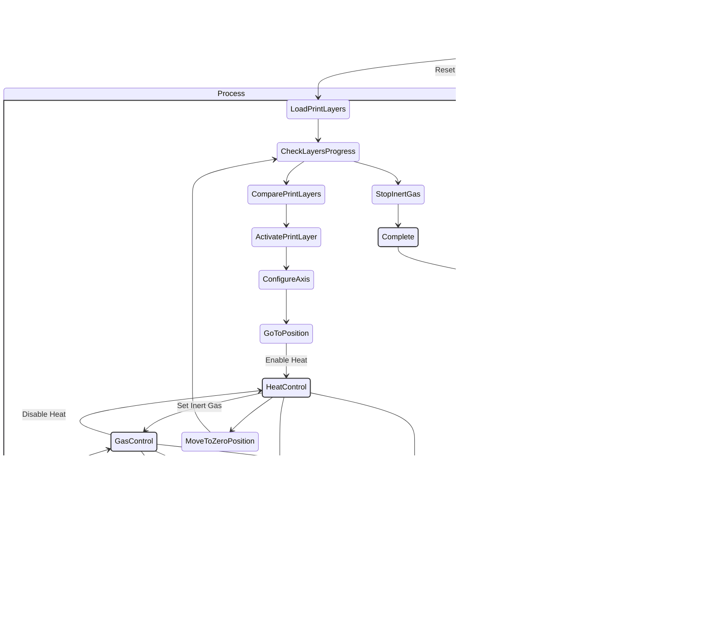

```mermaid
stateDiagram-v2
    [*] --> Idle

    Idle --> LoadPrintLayers
    Idle --> Reset : Reset system
    Idle --> Abort : User abort
    class Idle, Reset, Abort defaultColor

    state Process {
        direction TB
        LoadPrintLayers --> CheckLayersProgress
        CheckLayersProgress --> ComparePrintLayers
        ComparePrintLayers --> ActivatePrintLayer
        ActivatePrintLayer --> ConfigureAxis
        ConfigureAxis --> GoToPosition
        GoToPosition --> HeatControl : Enable Heat
        HeatControl --> GasControl : Set Inert Gas
        GasControl --> ReactantControl : Start Reactant
        ReactantControl --> PrecursorControl : Start Precursor
        PrecursorControl --> RunGCode
        RunGCode --> PrecursorControl : Stop Precursor
        PrecursorControl --> ReactantControl : Stop Reactant
        ReactantControl --> GasControl : Stop Inert Gas
        GasControl --> HeatControl : Disable Heat
        HeatControl --> MoveToZeroPosition
        MoveToZeroPosition --> CheckLayersProgress
        CheckLayersProgress --> StopInertGas
        StopInertGas --> Complete
    }

    Complete --> [*]
    class Complete defaultColor

    %% Error and Abort handling simplified with direct state reversals
    HeatControl --> Error : Error occurred
    GasControl --> Error : Error occurred
    ReactantControl --> Error : Error occurred
    PrecursorControl --> Error : Error occurred

    HeatControl --> Abort : User abort
    GasControl --> Abort : User abort
    ReactantControl --> Abort : User abort
    PrecursorControl --> Abort : User abort

    class Process, HeatControl, GasControl, ReactantControl, PrecursorControl defaultColor

    Error --> Idle : Resolve and reset
    class Error errorColor

    Abort --> Idle : Reset to Idle
    class Abort abortColor

    Reset --> Idle : Reset to initial state
    class Reset resetColor

    %% Define the colors
    classDef defaultColor stroke:#333, stroke-width:2px;
    classDef errorColor stroke:#FF6347, stroke-width:3px, fill:#FF6347, color:#FFF;
    classDef abortColor stroke:#6A5ACD, stroke-width:3px, fill:#6A5ACD, color:#FFF;
    classDef resetColor stroke:#2E8B57, stroke-width:3px, fill:#2E8B57, color:#FFF;

```