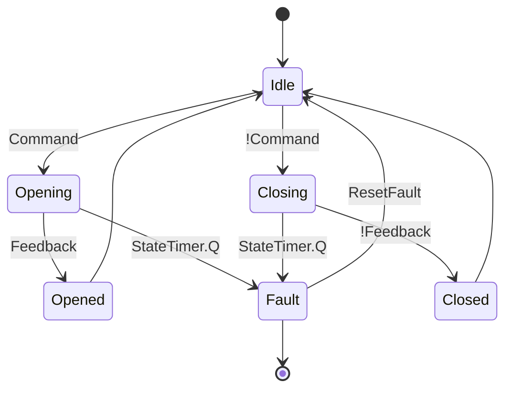

## State diagram


## Code
```bash
FUNCTION_BLOCK FB_ValveControl
VAR_INPUT
    Command : BOOL;          // Command to open (TRUE) or close (FALSE) the valve
    Feedback : BOOL;         // Feedback indicating the actual status of the valve
    MaxTime : TIME := T#5S;  // Maximum allowed operation time (default 5 seconds)
    ResetFault : BOOL := FALSE; // Command to reset fault condition
END_VAR

VAR_OUTPUT
    ValveOutput : BOOL;      // Digital output to control the valve
    State : ValveState;      // Current state of the valve
    Fault : BOOL;            // Fault status
END_VAR

VAR
    StateTimer : TON;        // TON timer for operation time monitoring
END_VAR

// State Machine
CASE State OF

    ValveState.Idle:
        // Reset Fault at the beginning of the state machine
        IF ResetFault THEN
            Fault := FALSE;
        END_IF
        IF Command THEN
            State := ValveState.Opening;
        ELSE
            State := ValveState.Closing;
        END_IF
        StateTimer(IN := TRUE, PT := MaxTime);

    ValveState.Opening:
        ValveOutput := TRUE;
        IF Feedback THEN
            State := ValveState.Opened;
            StateTimer(IN := FALSE);
        ELSIF StateTimer.Q THEN
            State := ValveState.Fault;
            StateTimer(IN := FALSE);
            Fault := TRUE;
        END_IF

    ValveState.Closing:
        ValveOutput := FALSE;
        IF NOT Feedback THEN
            State := ValveState.Closed;
            StateTimer(IN := FALSE);
        ELSIF StateTimer.Q THEN
            State := ValveState.Fault;
            StateTimer(IN := FALSE);
            Fault := TRUE;
        END_IF

    ValveState.Opened:
    ValveState.Closed:
        State := ValveState.Idle;

    ValveState.Fault:
        IF ResetFault THEN
            State := ValveState.Idle;
        END_IF
END_CASE
```
## Usuage
```bash
```
